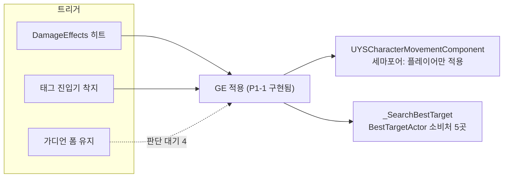
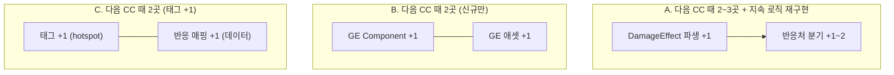

# 샘플 — 구조 판단: CC 체계 (MNYS, UE 5.7, git)

> 2026-10-01 평가 5 회차, 새 헤드리스 세션의 최종 답변 원문. 요청: `백로그 P3-12 CC 체계(속박·실명·도발) 구현해줘`
> 수정 도구는 막힌 상태였다. 코드 사실 일부는 사람이 교차 확인했다 (docs/VERIFICATION.md).

---

## 요청 축
- **언제**: 히트 시(`DamageEffects` 배열: 박병장 E, 마망 E), 착지 시(마보마이 태그 진입기), 폼이 유지되는 동안(가디언 어그로)
- **무엇을**: 속박은 이동 차단, 실명은 타겟 상실, 도발은 시전자를 강제 타겟으로
- **조건**: 지속시간(1.5초·3초), 중첩·갱신 규칙, 면역(슈퍼아머·보스) 여부
- **대상**: 적 AI. 플레이어가 CC를 받는 경우는 기획서에 없음
- **같은 축 과거 요청**: 기절(마망, `CHARACTER_BYEONGJANG#5.3`), *동결* 접두 속박 3초(`기획서#7.1`). CC 종류는 앞으로 더 늘어난다.

## 기존 확장 지점
- **히트 시 GE 적용**: P1-1은 이미 구현돼 있다. `FYSDamageEffect_ApplyGameplayEffect`(`YSDamageEffect.cpp:43-89`)가 `AddInstigator`로 시전자를 컨텍스트에 싣는다. 도발 시전자는 여기서 꺼내 쓰면 된다.
- **GE Component**: 베이스 `YSGameplayEffectComponent.cpp:8-13`에 제거 시 가상 함수가 있다. `UYSInputStateGEComponent`가 "GE가 붙어 있는 동안 상태를 push/pop"하는 선례다.
- **이동 차단**: `UYSCharacterMovementComponent::SetMovementBlocked` 세마포어가 있다. 다만 **이걸 읽는 곳은 플레이어 `Move()` 하나뿐**(`YSCharacterPlayer.cpp:193`)이라 AI 이동은 막지 못한다.
- **AI 타겟**: `UYSAIStateTreeTask_TargetActor::_SearchBestTarget` → `FYSTargetingActorCollections::BestTargetActor`(`YSStruct.h:309-353`). 소비처가 5곳(Focus, Evaluator, EQS 컨텍스트, AI 어빌리티, 점수 함수)이라 여기 한 곳을 막으면 전부에 반영된다.
- **태그 게이트**: ASC `OnGameplayTagStateChanged` 중앙 이벤트가 있고, StateTree에는 `FYSHasTagCondition`이 있다.
- **CC 태그는 0개**, 디버프 GE 애셋도 0개다.

## 신호
| 파일 | 커밋 | 해석 |
|---|---|---|
| `YSStruct` | 41 (3위) | 도발 슬롯을 `FYSTargetingActorCollections`에 넣으면 hotspot을 건드린다 |
| `YSGameplayTag` | 29 (6위) | CC 태그를 여기 늘리면 hotspot이 커진다. 태그 최소화 방침과도 겹친다 |
| `YSDamageEffect` | 4 | 조용한 파일이다. co-change도 50% 이하로 약하다 |

커밋 218개는 단일 작성자라 결합 신호가 약하다. 판단은 정적 구조 위주로 했다.

## 선택지

### A. 국소 패치: `FYSDamageEffect` 파생 3개(Root/Blind/Taunt) + 각자 타이머
- **다음 CC(기절·둔화) 때 고칠 곳**: 파생 1개 + 반응처 1~2곳. 지속·중첩·해제를 파생마다 따로 구현해야 한다. **땜질이다.**
- **트레이드오프**: GAS를 안 거쳐 가장 빨리 돈다. 대신 지속시간·중첩·정화·면역을 CC마다 다시 만들게 되고, 착지·오라 트리거(히트가 아닌 경우)에는 못 쓴다.
- **근거**: 넉백 선례와 결은 같다. 하지만 넉백은 단발이고 CC는 지속형이다.

### B. GE + CC별 GE Component (태그 신설 0개)
`UYSRootGEComponent`, `UYSBlindGEComponent`, `UYSTauntGEComponent`를 만든다. 각 컴포넌트가 적용될 때 반응을 걸고, 제거될 때 되돌린다. 모든 트리거는 GE 적용 하나로 수렴한다(히트는 기존 `ApplyGameplayEffect`, 착지·오라는 어빌리티에서 적용).
- **다음 CC 때 고칠 곳**: GE Component 1개 + GE 애셋 1개. 기존 파일은 안 건드린다.
- **트레이드오프**: 지속·중첩·해제를 GAS에 맡기고 태그도 늘지 않는다. 대신 "지금 속박 중인가"를 묻는 쪽(StateTree 조건, UI 아이콘)이 태그로 조회할 수 없다. 그런 요구가 생기면 컴포넌트 조회 API를 따로 만들어야 한다.
- **근거**: `UYSInputStateGEComponent`와 같은 형태다. 태그 최소화 방침에 맞는다.

### C. GE 태그 + 캐릭터 측 CC 반응 컴포넌트 (옵저버)
GE가 `State.CC.Root/Blind/Taunt` 태그 3개를 부여한다. 캐릭터의 `UYSCrowdControlComponent`가 `OnGameplayTagStateChanged`를 구독해 이동·AI 타겟에 반영한다.
- **다음 CC 때 고칠 곳**: 태그 1개 + 컴포넌트의 태그→반응 매핑 1항목. 반응 매핑을 데이터(태그 → 반응 인스턴스드 구조체)로 빼면 코드는 안 고쳐도 된다.
- **트레이드오프**: StateTree `FYSHasTagCondition`, 면역(GE Application Tag Requirements), UI가 전부 태그로 조회된다. 대신 태그 3개 이상이 hotspot `YSGameplayTag`에 추가된다.
- **근거**: 같은 축의 요청이 3건 이상이라 새 구조를 둘 요건은 된다.

## 모든 선택지 공통: 판단 대기
1. **AI 속박 방식**: 세마포어가 AI 이동에는 안 먹는다. 선택지는 두 가지다.
   - (a) `UYSCharacterMovementComponent::GetMaxSpeed`가 차단 중이면 0을 반환: 플레이어와 AI를 한 곳에서 막는다. 대신 기존 `bBlockMovementDuringAbility`의 의미가 "입력만 막음"에서 "이동 자체를 막음"으로 넓어진다. 루트모션 영향은 **검증 안 됨**.
   - (b) AI는 StateTree 조건으로 이동 태스크를 막는다: 기존 의미는 유지된다. 대신 속박을 두 곳에서 구현한다.
2. **실명의 의미**: AI의 타겟을 해제하고 탐색을 멈추는 것인지, 명중률 페널티인지 기획서에 없다. 그리고 실제 `TargetingEQS` 애셋이 Sight와 Hearing 중 무엇을 쓰는지 **확인이 필요하다**.
3. **도발 시전자를 담을 자리**: `FYSTargetingActorCollections`에 강제 슬롯을 두면 hotspot을 건드린다. `_SearchBestTarget` 안에서 대상 ASC의 GE를 조회하면 구조체는 그대로 두는 대신 태스크가 GAS를 알게 된다.
4. **가디언 어그로 흡수**: "3초 도발"과 같은 것인지, 폼이 유지되는 동안의 상시 우선순위(위협도)인지. 후자라면 도발과 별개 시스템이다.

## 그림

A, B, C 중 구조와 공통 판단 대기 1~4번을 정해주면, 검증 기준부터 적고 구현에 들어가겠습니다.