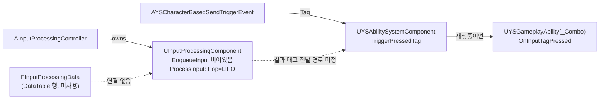
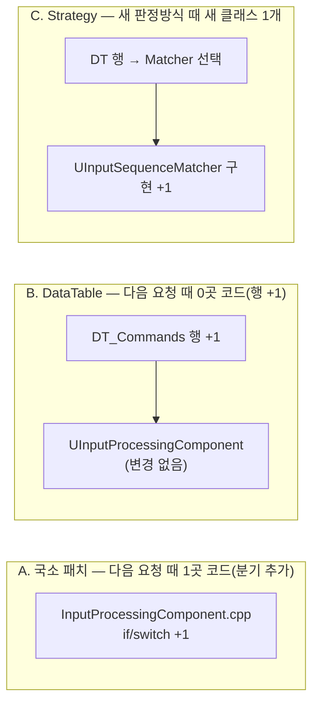

# 샘플 — 구조 판단: 새 프로젝트 커맨드 입력 (UE 5.6, VCS 없음, bootstrap 만)

> 2026-10-01 평가 5 회차, 새 헤드리스 세션의 최종 답변 원문. 요청: `커맨드 입력 판정 로직(입력 시퀀스 → 결과 태그) 구현해줘`
> 수정 도구는 막힌 상태였다. 코드 사실 일부는 사람이 교차 확인했다 (docs/VERIFICATION.md).

---

아직 코드는 쓰지 않았습니다. 이 프로젝트 규칙상 기능 요청은 구현 전에 구조 조사를 거칩니다. 요청 앞의 `[SKIP]`이 이 절차를 건너뛰라는 뜻이라면 알려 주세요. 그때는 트레이드오프를 한 줄로 말하고 바로 구현하겠습니다.

## 요청 축
언제: 입력이 들어오고, 0.2초 타이머로 처리할 때 / 무엇을: 입력 시퀀스를 결과 GameplayTag로 판정 / 조건: 시퀀스 일치(`bExactMatch`) / 대상: 이 컴포넌트를 가진 컨트롤러와 그 캐릭터
같은 축의 과거 요청: 코드 안 주석 1건뿐입니다(`YSCharacterBase.cpp:145` "인풋 콤보 같은걸 하고 싶다면?"). 기획서와 결정 기록은 없습니다.

**직접 정하셔야 할 것:**
1. `bExactMatch`의 뜻: 버퍼 전체가 일치해야 하나요, 아니면 버퍼 끝부분(suffix)만 일치하면 되나요?
2. 입력이 버퍼에 얼마나 남나요? 타이머 한 번 동안인가요, 시간 창을 따로 두나요?
3. 여러 행이 동시에 맞으면 어느 쪽을 고르나요? (가장 긴 시퀀스, 테이블 순서 등)
4. 결과 태그는 어디로 보내나요? 기존 `ASC->TriggerPressedTag`로 보내나요, 델리게이트로 알리나요?
5. 캐릭터가 바라보는 방향에 따라 좌우 입력을 뒤집어야 하나요?

## 기존 확장 지점
- **판정 로직 뼈대가 이미 있습니다.** 비어 있을 뿐입니다.
  - `FInputProcessingData` (`Variant_InputProcess/Data/InputProcessingData.h:14`): DataTable 행 구조체이고, 필드는 `InputTypeSequences`, `bExactMatch`, `ResultGameplayTag`입니다.
  - `UInputProcessingComponent` (`InputProcessingComponent.cpp`): `EnqueueInput`는 비어 있고, `ProcessInput`에는 `// Input Process.` 자리만 있습니다. `AInputProcessingController`가 이 컴포넌트를 소유합니다.
- **GAS 쪽 태그 입력 경로:** `UYSAbilitySystemComponent::TriggerPressedTag`는 어빌리티가 재생 중이면 입력을 `OnInputTagPressed`로 넘기고, 아니면 어빌리티를 활성화합니다. `UYSGameplayAbility_Combo`가 이 경로를 씁니다.
- **입력과 태그 매핑:** `UInputConfig` DataAsset(`FTaggedInputAction`)입니다.
- **발견한 문제:** `ProcessInput`이 `TArray::Pop()`을 씁니다. 이 함수는 마지막 원소를 꺼내므로 입력이 역순(LIFO)으로 처리됩니다. 시퀀스를 판정하려면 순서가 뒤집히면 안 되니, 어느 선택지든 함께 고쳐야 합니다.
- 애셋 인덱스에 올라간 DataTable 애셋은 0개입니다.

## 신호
VCS가 없어서 변경 이력 신호(hotspot, co-change)는 뽑지 않았습니다. 정적 구조만으로 판단했습니다. `Variant_InputProcess`는 참조하는 곳이 컨트롤러 하나뿐이라, 고쳐도 영향 범위가 작습니다.

## 선택지
### A. 국소 패치: `ProcessInput` 안에 시퀀스별 if/switch를 하드코딩
- **다음 커맨드를 추가할 때 고칠 곳:** 1곳(`InputProcessingComponent.cpp`)에 분기를 하나 더 넣습니다. 땜질입니다.
- **트레이드오프:** 가장 빨리 돌아가게 만들 수 있지만, 이미 있는 `FInputProcessingData`를 쓰지 않게 되고, 커맨드를 늘릴 때마다 C++을 고치고 다시 빌드해야 합니다.
- **근거:** 데이터 구조체가 이미 정의돼 있습니다. 이걸 무시하는 방향입니다.

### B. 기존 뼈대 채우기: DataTable에서 판정
- **내용:** 컴포넌트에 `UDataTable*`(행 타입 `FInputProcessingData`)과 입력 히스토리 버퍼를 둡니다. `EnqueueInput`은 큐에 넣고, `ProcessInput`은 FIFO로 버퍼에 옮긴 뒤 행마다 대조하고, 결과 태그를 내보냅니다.
- **다음 커맨드를 추가할 때 고칠 곳:** DataTable 행 1개만 추가하면 됩니다. 코드는 0곳입니다. 새로운 *판정 방식*이 필요할 때만 컴포넌트 1곳을 고칩니다.
- **트레이드오프:** 커맨드 추가가 데이터 작업이 됩니다. 대신 판정 규칙이 컴포넌트 한 곳에 묶이고, 판정 방식을 바꿀 때 그 코드가 바뀝니다. 입력 사이 시간 창, 홀드 같은 규칙이 해당합니다.
- **근거:** `FInputProcessingData`, 컴포넌트, 컨트롤러가 이미 이 구조로 짜여 있습니다.

### C. 새 구조: 판정기를 Strategy로 분리
- **내용:** `UInputSequenceMatcher` 같은 인터페이스를 두고, Exact/Suffix/시간 창 같은 판정 방식을 각각 구현합니다. 각 행이 판정기를 고릅니다.
- **다음 판정 방식을 추가할 때 고칠 곳:** 새 클래스 1개만 추가합니다. 기존 파일은 0곳입니다.
- **트레이드오프:** 판정 방식을 늘리기 쉬워지지만, 지금은 판정 방식이 `bExactMatch` 하나뿐이라 추상화가 비용보다 앞섭니다.
- **근거:** 같은 축의 요청이 1건뿐이라 과설계 가드에 걸립니다. 지금은 A나 B로 가고, `bExactMatch` 같은 판정 플래그를 두 번째로 추가해야 할 때 C로 옮기는 게 조건입니다.

## 그림

**현재 구조**

**다음 커맨드를 추가할 때 선택지별로 고치는 곳**

A, B, C 중 하나를 고르시고 위 질문 5개에 답해 주시면, 먼저 검증 기준을 적고 그다음 구현하겠습니다. 빌드·테스트 명령은 아직 정해지지 않아서, 구현하더라도 검증되지 않은 상태로 드리게 됩니다.

같은 종류의 요청이 또 오면 고칠 곳: B라면 DataTable 행 하나이고, 판정 방식을 새로 추가할 때만 컴포넌트를 고칩니다.