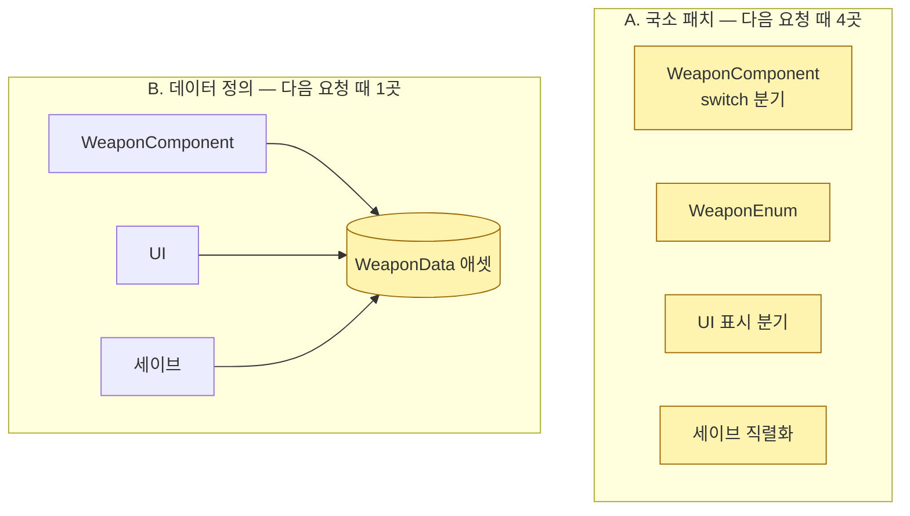
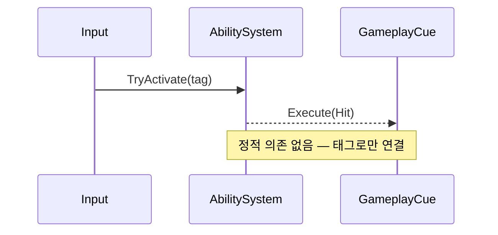

# 구조 근거 그림 — 규칙과 템플릿

## 목차
1. 공통 규칙
2. 현재 구조도
3. Before/After change-impact
4. co-change 그래프
5. 이벤트 흐름 (sequence)
6. 렌더링 (GitHub / GitLab / SVN)

## 1. 공통 규칙

- 원본은 Mermaid. `graph TD`/`graph LR` 만 쓴다 — `flowchart` 키워드, C4 문법(experimental), HTML 라벨은 렌더러마다 깨진다.
- 노드 15개 이하. 넘으면 관련 없는 노드를 빼거나 그림을 나눈다. 그림 하나에 주장 하나.
- 수치는 간선 라벨에 (`"45% (12)"`). 수치 없는 그림은 근거가 아니라 설명이다.
- 강조는 `classDef` 두 개만: `hit`(이번에 고치는 곳), `risk`(hotspot·fan-in 높음).
- 노드 라벨은 사람이 읽는 이름. 전체 경로는 표에 둔다.

## 2. 현재 구조도


범례 한 줄을 그림 아래에 적는다: "붉은 노드 = hotspot 상위 3".

## 3. Before/After change-impact

"다음에 같은 종류의 요청(예: 새 무기 종류)이 오면 어디를 고치나"를 선택지별로 그린다.
**강조된 노드 수가 그 선택지의 change amplification** 이다. 제목에 숫자를 적는다.



`<br/>` 은 GitHub·GitLab 에서 렌더된다. Azure DevOps 위키는 HTML 라벨을 막으니 거기선 빼라.

## 4. co-change 그래프

`evidence.py coupling --mermaid` 출력을 그대로 쓰고, 정적 의존이 없는 간선(숨은 결합)만 점선으로 바꾼다:
`n0 -.-|"45% (12)"| n1`. 간선 라벨 = degree (함께 바뀐 커밋 수).

## 5. 이벤트 흐름 (sequence)

델리게이트·GameplayEvent·SO 이벤트 채널은 정적 그래프에 안 나온다. 흐름이 핵심이면:



## 6. 렌더링

| 환경 | 방법 |
|---|---|
| GitHub (.md, PR, 이슈) | 코드 블록 ```` ```mermaid ```` 그대로 |
| GitLab | 그대로 (self-managed 는 CORP 헤더 설정에 따라 실패할 수 있음) |
| Azure DevOps 위키 | `::: mermaid` 블록, `graph` 만, HTML 라벨 불가 |
| SVN / Confluence / 메일 | `python render.py <파일.md>` → 단일 `.html` 을 브라우저로 연다 |

`render.py` 는 CDN 의 marked·mermaid 를 쓴다. 사내망에서 CDN 이 막히면 `marked.min.js`, `mermaid.min.js` 를
한 폴더에 받아 두고 `--js-dir <폴더>`. 스크립트를 못 불러오면 원문 Markdown 이 그대로 보인다.
